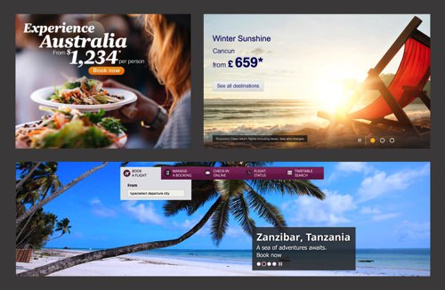
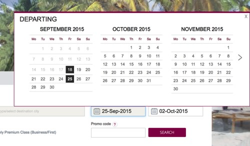
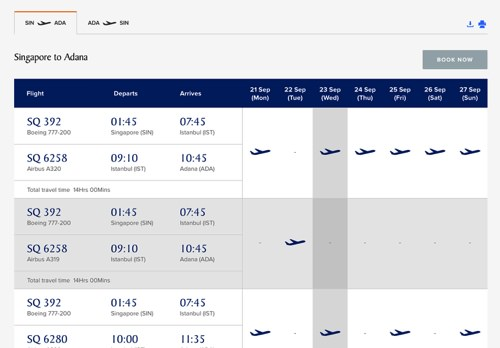
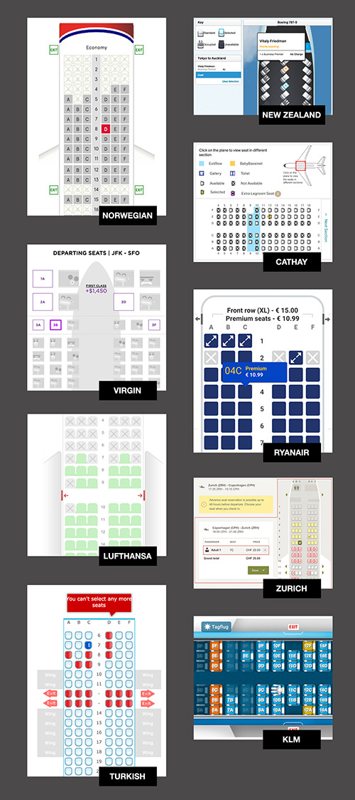

## The State Of Airline Websites 2015: Lessons Learned

-   By Joshua Johnson
-   November 10th, 2015
-   Performance UX

*With this article, we start exploring various industries and study the
**current state of front-end, UX and performance** of relatively complex
websites. First up are airline websites. Some sections of the article
were written by the editorial team. We’d love to hear your flights
booking experience in the comments to this article! — Ed.*

From my home in Phoenix, Arizona, the entire world is only a few clicks
away. I’ve booked flights to St. Louis, San Francisco, Honolulu, New
York, London, Melbourne, Entebbe and beyond. Sometimes I’ll land in one
location, travel around and leave from another. Sometimes I’ll switch or
cancel a flight, and sometimes the weather does that for me. Regardless,
I always get to where I want to go, and fantastic technology is in place
to help me every step of the way.

All of this tends to be so easy that I take it for granted. But let’s
think about this process from a designer’s perspective. Taking such a
diverse system of possible actions and turning them into a
user-friendly, self-serve experience is a **pretty complex challenge**.
Any experienced traveler will tell you that some companies do it better
than others. To find out, let’s take a closer look at a few airline
websites from around the world.

Along the way, we’ll discover the critical steps of booking air travel
and how they’re presented by different companies.

### The Airlines

开始前，我们先选择15家评价较高的航空公司，取全球排行前五名：
[评价最高的航空公司](http://www.worldairlineawards.com/awards/world_airline_rating.html)

-   [卡塔尔航空](http://www.qatarairways.com/global/en/homepage.page)
-   [新加坡航空](http://www.singaporeair.com/en_UK/us/home)
-   [国泰航空](http://www.cathaypacific.com/cx/en_US.html)
-   [土耳其航空](http://www.turkishairlines.com/en-us/)
-   [阿联酋航空](http://www.emirates.com/us/english/)

然后补以如下10家航司：

-   [维珍美国](https://www.virginamerica.com) (responsive)
-   [汉莎航空](http://www.lufthansa.com/uk/en/Homepage)
-   [瑞安航空](http://www.ryanair.com) (responsive)
-   [新西兰航空](http://www.airnewzealand.com)
-   [挪威航空](http://beta.norwegian.com/) (responsive)
-   [达美航空](http://www.delta.com)
-   [瑞士航空](https://www.swiss.com) (responsive)
-   [荷兰皇家航空](http://www.klm.com) (responsive)
-   [阿斯塔纳航空](http://airastana.com/) (responsive)

### 研究范围限制

在一片文章中深入对比15个网站是不现实的，所以我们将缩小比较方向：首页，布局，预订流程和性能。

Obviously, a deep dive into 15 websites is far too much to cover in a
single post. So, we’ll limit ourselves to certain areas: each website’s
home page **layout, booking process and performance**. That’ll give us a
good introduction to how each airline’s website operates. Also note that
most of these websites have several localized versions. For the sake of
sanity, we’ll stick to the English versions.

Fair warning: Objectivity is awesome, but any design critique you’ll
ever read is chock-full of subjective observations. This one is no
different. That being said, I welcome friendly disagreement and
discussion.

### 首页

To begin, let’s briefly look at the home pages of each of these
websites. This is the first place most potential customers will land
when looking to book a flight, so it’s absolutely critical. After even
two or three seconds on a website’s home page, you’ll find that you form
qualitative opinions about the company that are difficult to ignore.

#### 设计目标

As we analyze these designs, we should always think about what the goals
of the page are. Here are some truly **base-level goals** that I think
all airline home pages share:

-   Convey the company’s brand and identity.
-   Inspire and educate curious potential travelers to make a purchase.
-   Direct customers looking to make a purchase to the correct user flow
    (and/or answer their questions).
-   Direct customers who have already made a purchase to the information
    or actions they need (checking in, checking flight status, etc.).

The websites we’ll be looking at were designed by professionals. All of
them are fairly attractive and easy to use. So, when we talk about
strengths and weaknesses, it’s really only relative to the other
websites on this list.

#### 留白 vs. 效率

In comparing all websites, [Turkish
Airlines](http://www.turkishairlines.com/en-us/) is the one that stands
out as the **most cluttered**. The design very tightly clumps all of the
various elements, without allowing for much breathing room. In the
visual hierarchy, instead of a clear path, we find a lot of evenly
weighted items competing for our attention (the busy background pattern
doesn’t help). Instead of naturally finding a logical progression, my
eyes bounce around, looking at all of the separate little UI elements.
It takes quite a bit of effort to fully explore the page.

[Qatar Airways](http://www.qatarairways.com/global/en/homepage.page)
(ranked number one worldwide) suffers from these same issues but to a
lesser degree. Its design is a bit more airy, with sections that are a
little more visually distinct.

The upside of these designs is that they are quite efficient. Some of
the other home pages look and feel much cleaner, but the design takes up
a ton more room and requires a **great deal of scrolling** as a result.
For example, [Cathay
Pacific](http://www.cathaypacific.com/cx/en_US.html)’s home page is
longer than Turkish Airlines and Qatar Airways’ combined!
[Emirates](http://www.emirates.com/us/english/) isn’t quite as long as
Cathay, but ranks a close second.

Moving along, [Lufthansa](http://www.lufthansa.com/uk/en/Homepage) has
one of the more visually appealing pages, with its big, beautiful
photos, and it’s another long scroller. By comparison, [Air New
Zealand](http://www.airnewzealand.com/)’s is super-short, and Singapore
Airlines’ falls somewhere in between.

Finally, [Delta](http://www.delta.com/), [Virgin
America](https://www.virginamerica.com/) and
[Ryanair](http://www.ryanair.com/) all fall in the mid-range. All have
plenty of information, options and white space on the home page, while
minimizing the scrolling necessary to get through it all. On contrary,
minimalistic designs by [SWISS](https://www.swiss.com) and [Norwegian
Airlines](http://beta.norwegian.com/) do seem as appealing as the ones
with heavy imagery.

Aesthetically, I can’t help but feel that the most attractive pages here
(Lufthansa, Cathay Pacific, etc.) take the longest to scroll through,
unfortunately. Similarly, as mentioned, the shorter pages tend to be
less attractive.

SWISS, Norwegian Airlines and RyanAir seem to have the simplest designs.

**Design is about tradeoffs**. Every seemingly simple decision, such as
removing or adding white space, affects the overall experience. Of
course we don’t know whether the airlines websites ran A/B tests on
whether users find it easy to use the site, but the airlines websites
with more white space *did* feel easier to work through. Always predict
the effects that your decisions will have on end users, and then test
those assumptions post-launch.

### Promoting Airline Quality Vs. Wanderlust

Another interesting tradeoff I see in these designs speaks directly to
two of the goals outlined earlier:

-   Convey the company’s brand and identity.
-   Inspire and educate curious potential travelers to make a purchase.

Both the imagery and copy on these websites tend to tackle only one of
these goals at a time. Below, all three of the images, pulled from
Singapore Airlines and Lufthansa, **primarily promote the airlines
themselves**, rather than particular destinations. We all know that long
flights can be incredibly uncomfortable, so the primary message here is
that these airlines have your comfort as a top priority. Also, notice
that two of the three promise added comfort through a more expensive
ticket.

Contrast the technique here with the one exhibited in the images below.
Here, it’s not about the airline itself, but about what flying
represents — a way to **escape to exciting and exotic locations**:
Australia, Cancun, Zanzibar.

Some of the airlines focus on one of these strategies, while others try
to juggle both, typically through the use of sliders that cycle through
several messages and photos. This raises an important question. Are
these sliders effective? Can these airlines effectively promote both
their brand and their destinations by cycling through different sales
pitches?

#### 处处轮播广告

Almost every website in our list uses **at least one image slider**.
Some use several. Singapore Airlines uses *three* sliders on the home
page alone (four, if you count the small rotating news feed). In fact,
sliders seem to be a logical and attractive way to fit a ton of content
in a small space. However, as it turns out, some faulty assumptions
might be at play here — namely, that a typical user will pay attention
to, wait for and/or interact with a slider. Yet in many cases, sliders
can actually cost you conversions. A quick search of studies and
discussions on sliders reveals
[quite](http://conversionxl.com/dont-use-automatic-image-sliders-or-carousels-ignore-the-fad/)
[a
bit](http://searchengineland.com/homepage-sliders-are-bad-for-seo-usability-163496)
[of](http://marketingland.com/rotating-banners-image-sliders-kill-conversions-89984)
[animosity](https://yoast.com/opinion-on-sliders/) towards this
particular UI element.

Notice the strong language in the titles of these articles. Some
designers are not only abandoning sliders, but viciously attacking them,
too. That being said, we can’t assume that this sentiment is universal.
Just because some people have found that their own sliders have reduced
conversions doesn’t necessarily mean that all sliders on all websites
are bad. Some UX professionals advocate not for killing sliders
altogether, but rather for [optimizing their
design](http://uxmovement.com/navigation/why-users-arent-clicking-your-home-page-carousel/)
for [better
results](http://www.jacksonwynne.com/image-slideshow-alternatives/).

One slider that clearly needs some work is Delta’s:

Regardless of the viewport’s width, the photos in these sliders are
brutally murdered by CSS. They’re being squished instead of cropped, an
effect that’s exaggerated when you see the original images before the
CSS takes hold:

This is a clear case of a slider being poorly executed. However, we
can’t accuse all sliders of having these same problems. A simple way to
make a slider more usable is to **provide context to users** — for
example, thumbnails and text that explain what each item in the slider
stands for. Sliders could also be made responsive, showing more items
prominently when enough space is available and fewer items otherwise.

Airlines seem to depend on this particular UI element quite heavily,
which makes all of the sliders look very similar, almost generic. I’d
argue that the airlines might be well served by exploring and testing
alternatives, such as an **accordion or tabbed widget**.

#### 次要任务

Now that we’ve made some sweeping macro-level observations about these
pages, let’s dive to the micro level. Referring to our goals above, we
see that visitors to these home pages often need to accomplish a number
of secondary tasks (the purchase flow being the primary directive):
**checking in**, checking their flight status, etc. Most of the websites
are similar in how they handle these tasks, but a few interesting
details are worth noting.

The winner in this category is [Virgin
America](https://www.virginamerica.com/). Rather than bombarding you
with a million options, the home page is amazingly simple. One of the
first items on the page distills almost all of the visitor’s major tasks
into three simple categories: “Book,” “Check in” and “Manage.”

Even if we zoom out and consider the entire navigation menu, it’s
surprisingly concise. The visual hierarchy is straightforward, too.
Notice how the designers have used bolded text and all caps as well as
subtle vertical dividers to differentiate the sections.

Contrast this with Emirates’ experience, which has **both vertical and
horizontal navigation**. However, the information all blends together.
The page doesn’t have many more links than Virgin’s, but the lack of
differentiation and hierarchy makes it feel much more difficult to sift
through. Quick skimming is not a possibility here. I feel like I have to
slowly and deliberately read each item to find what I’m looking for.

One link that I always find myself hunting for on any airline website is
the one for **checking in**. It’s a key step when you have an upcoming
flight, and it should be easy to find on any airline website. As we saw
above, it’s pretty prominent on Virgin America’s home page. In fact,
most of the websites in our list prioritize it in the header.

Unfortunately, not all websites make it so easy. Let’s see Lufthansa’s
header.

Given up yet? You should have, because the link for checking in is
nowhere to be found in the top 600 pixels of the home page. It’s way
down, below that big graphic:

To be fair, this area is dedicated almost entirely to checking in, and
it is also very clean and attractive. As much as I appreciate the design
of this section on its own, though, my instinct was to hunt for this
information at the top of the page, and not being able to find it **was
pretty frustrating**.

It’s quite unlikely that Lufthansa’s user data shows that this is the
best spot for the check-in widget. Or maybe that’s just where the
designers stuck it because it looked good in the layout. Nevertheless,
checking in doesn’t seem to be prioritized for the user, and unless you
travel with Lufthansa a lot, it is difficult to spot. One can imagine
that many travellers, once disappointed, would query “Lufthansa
check-in” in a **search engine** instead — not a good experience.

It holds true everywhere: as designers, our job is to simply
**prioritize important actions** and display them prominently. Never
hide them behind an icon or button. Make them visible and easily
accessible on desktop, tablet and mobile. Prioritize user needs, not
company’s branding.

Your list of priorities might be huge and difficult to rank, and that’s
exactly what designers of airline home pages face. One place to look for
help is competing websites; you could identify common problems with user
flow and start designing a better experience for precisely those
problems.

Everybody wants to be better than their competitors, so address these
issues head on. You could go as far as **creating a spreadsheet with the
most critical tasks and constraints**: How could you add a bit of
delight to the experience or reduce complexity? If you’re building a
responsive website, look into the content itself in its purest form,
examine it and **repackage it** to best suit the challenges of different
form factors.

If you present pricing options for flights in a table on the desktop,
you don’t necessarily have to keep it as a table on tablets and phones;
it could be a set of accordions with data lists, for example. A seating
plan on the desktop could be transformed into a UI that first offers
general seating options and, based on the user’s selection, provides a
simplified seating map with zooming functionality and a supporting data
list.

#### Mobile Experience

Another important aspect of airlines websites is mobile strategy. In
this data set, we have a sort of microcosm for how the Internet as a
whole handles mobile users in 2015: A few websites have gone fully
responsive, even more reroute users to a dedicated mobile website, and
still others do absolutely nothing. ~~Fortunately, at the time of
writing only one airline, Ryanair, leaves mobile users out completely
(depending on the user’s IP address, though — it seems to be rolling out
a new responsive website now).~~

Here are the airlines with a **responsive** website:

-   [Singapore Airlines](http://www.singaporeair.com/en_UK/us/home)
-   [Cathay Pacific Airways](http://www.cathaypacific.com/cx/en_US.html)
-   [Virgin America](https://www.virginamerica.com)
-   [Lufthansa](http://www.lufthansa.com/uk/en/Homepage)
    (kind-of-responsive)
-   [SWISS](https://www.swiss.com)
-   [KLM](http://www.klm.com)
-   [Air Astana](http://airastana.com/)
-   [Norwegian Airlines](http://beta.norwegian.com/)
-   [Ryanair](http://www.ryanair.com)

Here are the airlines with a **dedicated mobile** website:

-   [Qatar Airways](http://www.qatarairways.com/global/en/homepage.page)
-   [Lufthansa](http://www.lufthansa.com/uk/en/Homepage) (which has both
    a mobile website and a responsive desktop website)
-   [Turkish Airlines](http://www.turkishairlines.com/en-us/)
-   [Air New Zealand](http://www.airnewzealand.com)
-   [Delta](http://www.delta.com)
-   [Emirates](http://www.emirates.com/us/english/)

### Flight-Booking Process

Now we get to the good stuff: booking a flight. Every airline on our
list agrees on one thing: that this process should start right on the
home page. That’s where the agreement ends, though. From here on out,
it’s a battle of ideas and UX strategies.

Let’s focus on some of the major pain points that we encountered with
some airlines and how these are solved or addressed by others.

#### Too Much Or Too Little

The flight-booking widgets across the home pages vary dramatically in
complexity. Typically, you’ll see something like Singapore Airlines’
widget:

As you can see, the user has a good bit of work to do here. They have to
choose their cities, type of flight, dates, seating class and so on, all
from the home page before hitting the search button. Now contrast this
widget with Virgin’s:

The interesting thing is that both airlines have to collect the same
information. Singapore Airlines chooses to do it all in one place, which
can be daunting but convenient. Virgin opts to **draw out the process**,
pushing a lot of the work to later screens, but it feels more guided.

Overall, I like Virgin’s approach. The copywriting is friendly, and the
simple interface makes me feel like the process is going to be easy.
Remember that not every user books a flight and travels the globe
regularly. For many, flying is quite a stressful experience. As
designers, we have a great opportunity and even an obligation to reduce
the stress associated with complex activities by making UIs that are
simple, intentional and friendly.

That being said, Virgin’s widget is so simple that it might be
frustrating. For instance, every other website lets users type to filter
their destination. Virgin forces you to scroll through a list of results
and manually click where you want to go. (**Update**: This has either
been fixed or I totally missed that you can type in a destination in my
earlier review. Either way, it works great now.)

Qatar Airways is similarly limited but in exactly the opposite way. It
has no dropdown menu for users to choose from at all. Instead, users are
forced to type in the destination.

#### Revealed Complexity

A smart technique for dealing with a complex process is to make the
first step as simple as possible and then slowly reveal more as the user
works through the steps.

As you can see, Ryanair’s home page widget is both attractive and
simple. Once the user enters their destination, another step is
revealed.

If this happened more than once, it’d be frustrating, but I found the
interaction to be friendly enough the way it’s implemented.

A similar approach makes Virgin’s widget, which we saw earlier, seem
simpler than it actually is. The guest controls are hidden in a fairly
unconventional but easy-to-use dropdown menu.

#### Date-Picker Dilemmas

Providing a way for users to pick dates for a flight seems pretty
straightforward, but here’s an interesting question: How many months
should you show in the date-picker?

Some airlines show one month at a time, most show two, and Qatar throws
caution to the wind, showing a huge widget that lets users view three
months at a time.

Personally, I find that **three months feels excessive** and takes up
way too much space for a modal (it blocks half the page). One month is
fine, but two months is the sweet spot. Context is important: I’d wager
that the vast majority of round-trip flights aren’t longer than a month,
so a two-month view should be more than sufficient, while minimizing
side-scrolling.

#### In Search of Low Fares

Choosing a date is one of the main areas of frustration for me when
booking a flight. Like many travellers, I’m **flexible with my
schedule** because I know that leaving a day earlier or later than
planned can save me hundreds of dollars.

When forced to choose a firm date in one of those booking widgets, I
worry that I won’t be given the chance to see a calendar of fares and
that I’ll be stuck with my selection, instead of being able to shuffle
my dates.

Airlines deal with this pain point in different ways. Delta allows users
to choose between “Exact dates” and “Flexible days” (although the
wording there is inconsistent).

Next, though, they show this **crazy, mutant date-picker** that has both
a horizontal and vertical axis, allowing users to choose their departure
and return dates in one go. In fact, this component is consistently used
pretty much everywhere to display outbound and inbound flights along two
axis, with prices along both dimensions. The matrix can get quite
complex and overwhelming, especially if it contains more than 7 days on
each axis.

The whole double-axis thing is interesting, but in practice, I needed a
few seconds to figure out just what the heck I was looking at.

Air New Zealand implements its own version of this same idea to help
users find a low fare:

Putting the vertical-axis titles on the right side and not rotating the
text makes Air New Zealand’s fare finder easier to figure out, but I’m
still not convinced this piece of UI is user-friendly.

Instead of using a matrix, International shows a nice overview of
options, with corresponding prices, reducing the number of options to
four days. Norwegian Airlines shows prices for five days, and Cathay
Pacific, Singapore Airlines, Delta Airlines and Turkish Airlines show
for seven days. Air Astana provides a complicated comparison table, with
huge images as well as filtering and ordering options, which make the
interface quite difficult to use. Air New Zealand doesn’t have a matrix
at all; instead, it lets users choose a day to focus on (along with a
corresponding price) and then shows all of the options for that day.

I wonder whether an **alternate view of an accordion** with flight
options sorted by price would make the interface slightly less complex
and the experience slightly more enjoyable. The user could then choose
the view they prefer. In fact, the dual-view approach could work in many
scenarios — for example, when data could be presented as a graph or as a
table, or when an overview of products could be presented in a
thumbnail-grid view or as a data list.

#### “Don’t Make Me Repeat Steps”

One frustrating thing that Air New Zealand does (as well as others) is
force users to choose a date in the home page widget and then push them
into the calendar fare view, where they have to choose again. I
appreciate the effort in helping me find a low price, but if you’re
going to take me to the low-fare calendar anyway, why make me choose a
date on the home page? Wouldn’t it be better to ask me for the month or
week when I’ll be travelling instead, or guide me to the low-fare
calendar only if I explicitly choose to do so?

Virgin’s simpler process wins again here by making users choose dates
only once, and doing it on a page that lets them compare fares.

#### Actions That Aren’t Actions

Another surprisingly frustrating action is **choosing an actual
flight**. Seems like it should be easy, right? Not always. Take the
flight schedule from Singapore Airlines below. First, I don’t find the
plane/no-plane icon system to be intuitive, but let’s ignore that for
now. Let’s also ignore the lack of prices in this list. Instead, let’s
consider that you can’t actually select any of the flights in this
schedule.

Instead, you have to memorize which flight you want, then click “Book
Now,” and then start the booking process over with the widget on the
home page. It seems downright ludicrous to me that this is the process,
but that’s how it works.

Virgin makes a less serious but similarly confusing mistake. It presents
fare options in rows, and each row is highlighted when you hover over
it, which makes you think you can click it — but you can’t.

Instead, you **have to click on one of the little three squares**. This
makes for a confusing experience in which you try to select a flight,
click around, realize you’re doing it wrong, and then hunt around for
the right solution. To me, a hover effect almost always implies that a
click event is possible. This could be reworked so that a click on a row
does make a selection, which would refocus your attention by
highlighting the price boxes, or so that a click on a row selects one of
the options (probably the cheapest).

A final example of click frustration is shown below in Lufthansa’s
widget:

This little chart is a bit confusing. To make it worse, all of those
vague little icons look like clickable buttons, but they’re not; they
simply indicate the status of various options.

### Checkout Flow: From Start to Finish

The essence of an airline website’s experience is to enable customers to
purchase tickets seamlessly. Well, at least that’s what one would
expect. In reality, the checkout experience is often anything but
straightforward or seamless. Many things can (and do) go wrong, leaving
customers in the dark, forcing them to figure out an interface or
compare flight options. Admittedly, checkout experiences in general can
get quite complex, so getting it right isn’t exactly easy.

This complexity is evident in the **amount of effort required** from the
user to complete their purchase. Most airlines have between five and
seven steps in their checkout process — the travel dates are followed by
the flight selection, followed by upsells, followed by the seat
selection, followed by payment, followed by the confirmation screen.
Obviously, keeping the user actively involved throughout the process is
critical; so, many airlines highlight the selected flight and price by
**fixing them either in the sidebar or at the top** of the page — always
within view.

Sometimes, the booking experience is quite frustrating from the very
first step. Most airlines force you to select an airport to fly from,
not just a city. Selecting a multi-city route is often difficult because
the system assumes that you want to return to the city that you departed
from. Selecting more than two multi-city flights is often simply
impossible. For whatever reason, the lowest fare is usually highlighted
with a tiny triangle in the upper-left or upper-right corner of the
flight option — whereas highlighting the entire option instead might be
better.

Airlines often distinguish between low-fare calendars and normal
searches for flights, which assumes that users must **explicitly search
for low-fares** when booking a flight. On Singapore Airlines’ website,
one can choose between “View schedules” and “Search” for flights. The
interface for selecting a seat is usually annoyingly small; icons that
are used remarkably often are just as often unclickable; and users often
have to verify their email address by retyping it (of course, most of us
will just copy and paste our address, making this verification quite
useless). KLM tries to motivate visitors to make a quick purchase by
showing how many customers have just bought a similar flight or are
looking at the option right now.

On the bright side, most airlines allow users to check out as a guest by
default; as mentioned above, airport inputs usually have autocompletion;
a currency converter is provided more often than one might expect; and
sometimes you can even save a trip for future reference (Ryanair’s
“wishlist”), “hold a flight” for a couple of days (Air New Zealand),
automate your check-in (SWISS sends a boarding pass automatically 20
hours before departure) or even see the price in airlines miles (Delta).

All airlines have a good **old-fashioned payment form with 5–7 input
fields**. Not a single airline, though, uses the [single-field
credit-card input
pattern](http://bradfrost.com/blog/post/single-field-credit-card-input-pattern/);
customers are usually required to select their credit-card type first
and then input their digits. Testing transactions is a bit beyond the
scope of this article (and our financial allowance, too, by the way).

### Performance

Performance matters, and it affects conversions. However, finding a fast
airline website — whether responsive or not — proved to be quite
difficult. In most cases, airline websites load Modernizr, jQuery, a
jQuery plugin for carousels, custom web fonts and a tracking script such
as Omniture, Optimizely, OpenTag or uTag. All of these scripts together,
with an A/B testing application running in the head of the page, make
**most of the websites quite slow**. In fact, none of the reviewed
websites have a start-rendering time below 1.8 seconds, even with
optimal connectivity conditions, an average PageSpeed score is 50.5 on
mobile and 63.4 on desktop, and none of the websites support HTTP/2.

Airline websites with better performance did turn out to be responsive.
The fastest, though, [proved to be New Zealand
Airlines](http://www.webpagetest.org/result/151102_XY_18P1/)’s old
non-responsive website, with a start-rendering time of 1.79 seconds.

In terms of HTTP requests, the home page for [Norwegian
Airlines](http://www.webpagetest.org/result/151102_RP_18P9/) turned out
to be the leanest (and are probably the newest), with 42 HTTP requests
and weighing in at 1.1 MB. The design is well crafted, yet too many
scripts block the rendering of the pages. Norwegian Airlines uses
AngularJS. Performance is way better on subsequent loads, though.
Norwegian Airlines’ CSS runs 15,610 lines long; both follow the BEM
methodology.

Responsive doesn’t necessarily mean fast. Air Astana’s home page,
weighing in at 4.1 MB, is responsive yet only [starts rendering after 7
seconds](http://www.webpagetest.org/result/151102_8S_18PH/); Bootstrap,
jQuery, jQuery UI, three different theme skins and Telerik’s web UI have
been crammed into the head of the page. KLM’s responsive home page [is
faster](http://www.webpagetest.org/result/151102_HM_T53/) ~~and [scores
the highest on
PageSpeed](https://developers.google.com/speed/pagespeed/insights/?url=http%3A%2F%2Fwww.klm.com%2F&tab=desktop)~~,
but it loads a `blank.gif` file that is 365 bytes yet causes 569
milliseconds in latency.
[Lufthansa](http://www.webpagetest.org/result/151102_GQ_18NV/) is again
slightly better, yet it requires jQuery, Dojo and uTag.

\

[Norwegian
Airlines](https://developers.google.com/speed/pagespeed/insights/?url=http%3A%2F%2Fbeta.norwegian.com%2F&tab=mobile)
scores the highest on Page Speed, followed by
[Delta](https://developers.google.com/speed/pagespeed/insights/?url=http%3A%2F%2Fwww.delta.com%2F&tab=mobile)
and [Qatar
Airways](https://developers.google.com/speed/pagespeed/insights/?url=http%3A%2F%2Fwww.qatarairways.com%2Fglobal%2Fen%2Fhomepage.page&tab=mobile)
(both 64 on mobile). One shouldn’t make a mistake of comparing a
language splash page (KLM, on the left) with an actual airline website
(Norwegian, on the right). KLM doesn’t score as high on its internal
pages. 

Apart from Air Astana, another performance offender is
[Emirates](http://www.webpagetest.org/result/151102_E5_18NJ/), with its
306 HTTP requests and 151 KB (Gzipped) of JavaScript
(`controls-main.js`), although it starts rendering within 2.4 seconds!
Also, Ryanair’s new responsive home page, with its whopping [Speed Index
of 21,745](http://www.webpagetest.org/result/151106_C4_AN3/), makes 89
HTTP requests and has a start-rendering time of 9.5 seconds on a cable
connection. Ryanair makes heavy use of AngularJS and also loads a number
of JavaScripts in the head synchronously, blocking rendering of the
website. As discovered by Ben Schwarz, the reason for that is a plethora
of [expensive
selectors](https://medium.com/performance-snapshot/performance-snapshot-ryanair-s-2015-redesign-dbd508c78a33)
being used — after all, the CSS file is 2.88Mb in size ungzipped.

 [\
](http://www.webpagetest.org/result/151106_C4_AN3/)

[Ryanair’s
WebPagetest result](http://www.webpagetest.org/result/151106_C4_AN3/):
That’s a lot of blocking JavaScript.

On average, the home pages of airline websites are around 1.94 MB. The
code is usually quite up to date, yet every now and again you’ll find
legacy scripts and techniques used. For example, Emirates still uses
Cufón to deliver web fonts, with text embedded in images, and Lufthansa
still uses Flash for checking in and selecting seats.

### Lessons Learned

If you’ve never worked on an airline website, then hopefully this
article will help you appreciate the scale of the work, even if it just
scratches the surface of the complexity involved. From predicting
hundreds, even thousands, of user actions to deciding what to promote in
a limited amount of space, and even figuring out how many months to show
in a date-picker, a lot of design decisions need to be made.

#### Frustrations

All of these airline websites get the job done, but we discovered plenty
of minor and major frustrations:

-   Home page clutter overwhelms users with options.
-   To avoid clutter, too many airlines over-rely on sliders, which
    either hide important information or are clunky.
-   Multiple navigation menus on a single page can look crammed and flow
    in different directions, competing with each other visually.
-   Complex multi-matrix flight-booking widgets make the process of
    selecting a flight intimidating.
-   Redundant actions force users either to make choices they’re not
    ready to make or to repeat selections they’ve already made.
-   The UI for comparing flight prices is often weird and unexpected.
-   Users are often forced to play a guessing game about what’s
    clickable.
-   Low-fare calendars often appear at the wrong time and cause
    confusion, largely due to design.
-   During check-in, typing in passport and visa information is often
    very cumbersome. Smart defaults would go a long way. For example,
    birth date input fields and select menus are often set on the
    current date and, hence, require a lot of annoying scrolling.
-   After check-in, many airlines don’t provide enough information about
    the terminal, luggage restrictions and airplane.
-   Multi-city flights are typically impossible to book or just broken.
    Trips are often assumed to be either one way or return. And if you
    book a multi-city trip, you are expected to return to the city you
    departed from.

SWISS prompts a little pop-up if they assume that you are about to
abandon the purchase. 

#### Responses

In addressing these complaints, we can derive some important lessons on
designing projects of this scale:

-   Sliders might feel like a great way to manage clutter, but they are
    often a complete failure in interaction. If you’re putting critical
    information two or three slides in, odds are that many users will
    never see it. Never hide important content.
-   The answer to problems of information architecture isn’t to add a
    bunch of navigation menus. Prioritize and put the important content
    up front, throughout the different form factors.
-   Obvious but worth pointing out: in addition to keeping menus lean,
    consider visually differentiating them to establish a clear
    hierarchy, instead of having 15 identically styled links.
-   For lengthy processes, consider gradually revealing complexity as
    users progress, rather than overwhelming them up front.
-   Always be aware of which items are indicated as being clickable.
    Nothing confuses users quicker than not being able to figure out
    where to click.
-   Instead of showing a complex, mutant date-picker matrix, provide an
    overview of options for 4 days and highlight the lowest fares
    prominently (or even as a default selection).
-   Handy features such as airport input autocomplete, wishlist, flight
    reservation, automated check-in or currency converter help make the
    experience more delightful.
-   By prioritizing performance and providing a smooth UX, you can
    outperform competitors by a long shot — mostly because most airlines
    websites out there are quite slow and the experience is quite
    frustrating.

### Break Down The Complexity

Overall, airline websites are so completely inundated with information,
options, possible user flows, instructions and sales pitches that I
found any website that simply cleared out the mess and gave me some
space to be a breath of fresh air.

This is a primary reason why Virgin received more attention throughout
this article than almost any other airline. Overall, its website just
felt better. The design was clean and attractive, the copy was friendly,
and I was guided through the steps without much extra thought or
frustration.

You need only look at the image above to get a feel for what it’s like
to book a flight with Virgin. When you get to selecting a seat, the
occupied areas are adorned with silly faces. Most airlines take
themselves far too seriously to ever consider this delightful little
design quirk, which makes it that much more fun and refreshing.

Websites that try the hardest to think of and provide everything a user
might need are often the ones that fail the most in meeting our desires
and expectations. Those rare websites that cut away all the bloat and
leave us with a limited but solid core experience are the ones we
remember and come back to again and again. Sounds familiar, doesn’t it?
Well, it remains to be seen how airline websites will evolve —
hopefully, towards leaner, faster and more delightful experiences.
